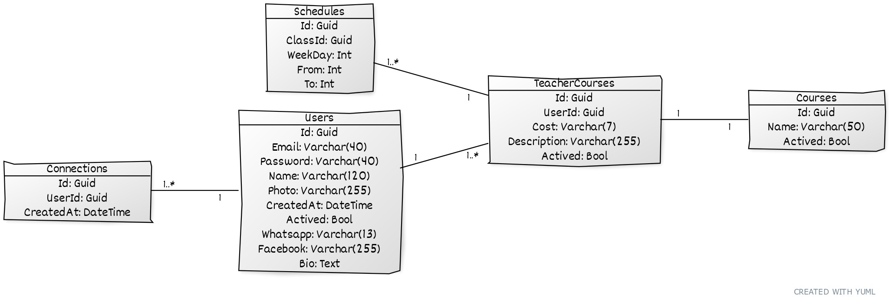
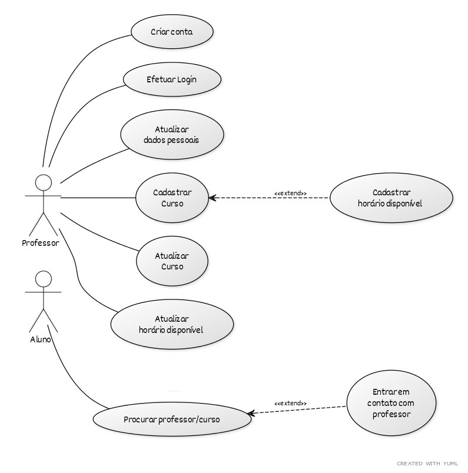

# Proffy - Sua plataforma de estudos online

## Índice

- [O que é Proffy?](#o_que_e_proffy)
- [Sobre o projeto](#sobre_o_projeto)
- [UML](#uml)
- [Protótipo](#prototipo)
- [Dívida Ténica / Visão](#divida_tecnica)

## O que é Proffy?

Proffy é uma plataforma que encurta a distância entre professores que realizam aula particular e alunos.

O professor cria uma conta com seu nome e contato, informa o que ensina (Ex.: Inglês, Química, Violão ou outros) e quais horários está disponível. O aluno acessa a plataforma, busca pela matéria, dia e horário desejado e pronto! O aluno escolhe um professor da lista, entra em contato e combina a aula.

## Sobre o Projeto

De onde surgiu Proffy? Bem... Dai a César o que é de César, a DEUS o que é de DEUS e os créditos a quem pertence.

- Proffy foi idealizado pela Rocketseat para a "Next Level Week #2" onde o back-end foi em NodeJS e o front-end em ReactJS e ReactNative ([Proffy v1](https://github.com/gonribeiro/Proffy/releases/tag/v1.0.0)). 

- Para a versão 2 ([Proffy v2](https://github.com/gonribeiro/Proffy/releases/tag/v2.0.0)), foi utilizado como projeto acadêmico para a entrega do trabalho do bloco de Microserviços e Mensageria da Pós Engenharia de Software .NET.

- A versão 3 (atual) mantém o back em .NetCore. É a continuidade dos meus estudos.

## UML

Banco de Dados

Casos de Uso

## Protótipo ([Visualizar](https://www.figma.com/file/gqUWbhU9Us0tVVPkmrWZrx/Proffy-Web?node-id=308122%3A1))

## Dívida técnica / Visão

- Web:
    - Mensagem de carregando durante as requisições.
    - React Select: 
        - Required não funciona.
        - Usar como componente
        - Corrigir exibição da lista.
    - Criar menu de navegação
- Server: 
    - Estruturá-lo em DDD
- Server e Web
    - Máscara e validação dos campos facebook, whatsapp e custo.
    - Impedir cadastro de disponibilidade de aula com hora fim menor ou igual a de inicio.
    - Atualizar token de acesso (https://code-maze.com/using-refresh-tokens-in-asp-net-core-authentication/).
    - Email de confirmação de criação de conta (conta deverá ser habilitada após confirmação).
    - Inserir descrição do curso no momento do cadastro pelo professor (campo já existente no banco de dados).
    - Permitir professor desativar ou excluir curso cadastrado.
    - Upload e armazenamento da foto de perfil.
    - Permitir professor cadastar vários cursos e horários.
    - Professor cadastrar novas categorias de matérias.
    - Opção para usuário redefinir a senha quando esquecida. 
    - Área do administrador.
    - Cadastro de alunos.
    - Avaliação do professor pelo aluno.
