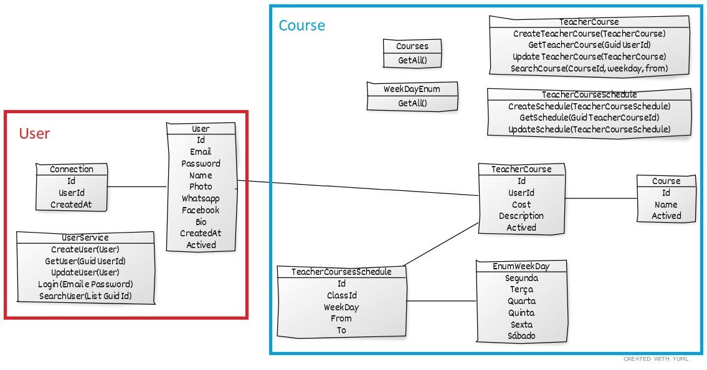

# Proffy - Sua plataforma de estudos online

## Índice

- [O que é Proffy?](#o_que_e_proffy)
- [Sobre o projeto](#sobre_o_projeto)
- [UML](#uml)
- [Protótipo](#prototipo)
- [Instalação](#instalacao)
- [Dívida Ténica / Visão](#divida_tecnica)

## O que é Proffy?

Proffy é uma plataforma que encurta a distância entre professores que realizam aula particular e alunos.

O professor cria uma conta com seu nome e contato, informa o que ensina (Ex.: Inglês, Química, Violão ou outros) e quais horários está disponível. O aluno acessa a plataforma, busca pela matéria, dia e horário desejado e pronto! O aluno escolhe um professor da lista, entra em contato e combina a aula.

[Apresentação pptx](docs/Apresentação.pptx)

## Sobre o Projeto

**Proffy é um projeto acadêmico para a entrega do trabalho do bloco de Microserviços e Mensageria da Pós Engenharia de Software .NET. Portanto, para atender as rubricas do trabalho, o back foi PROPOSITALMENTE segmentado em microserviços, estruturado em DDD e utilizado mensageria para a funcionalidade de envio de e-mail.**

De onde surgiu Proffy? Bem... Dai a César o que é de César, a DEUS o que é de DEUS e os créditos a quem pertence.

Proffy foi idealizado pela Rocketseat para a "Next Level Week #2" onde o back-end foi em NodeJS e o front-end em ReactJS e ReactNative ([Proffy v1](https://github.com/gonribeiro/Proffy/releases/tag/v1.0.0)). Sendo assim, estou aproveitando parte do front-end já criado, reescrevendo o back em .NetCore, incrementando ambos (back e front) com funcionalidades para a "versão 2" desse projeto que contém:

- Microserviço de Usuário: Responsável pelos dados do professor e a autenticação com JWT.
- Microserviço de Cursos: Responsável pelas informações dos cursos lecionados.
- Microserviço de Email: Responsável por enviar e-mail.
- Index de cada microserviço (exceto email) exibe a documentação API pelo Swagger.
- Utilizado RabbitMQ para mensagens. 
- Utilizado conceito "mobile first" onde as telas são responsivas se adaptando a computadores, tablets e smartphone.
- Estilização customizada (sem uso de bootstrap ou material design).

## UML

Domínio

Casos de Uso [.](https://www.ateomomento.com.br/caso-de-uso-include-extend-e-generalizacao/) [.](https://www.uml-diagrams.org/class-diagrams-overview.html)

## Protótipo ([Visualizar](https://www.figma.com/file/ZRvbZ16cOsFlcir702PbS4/Proffy-Web?node-id=308122%3A1))

## Instalação

Olá! Aqui irei informar apenas alguma particularidade do projeto para auxiliá-lo na execução. 

Sendo assim, assumo que já possua o conhecimento necessário com .NetCore3.1 e ReactJS e consiga executar ambos ambientes (web e server).

- Ao executar o projeto do "server - .netcore", tenha certeza de executar o UserMicroservice e CourseMicroservice simultâneamente.
    - No Visual Studio, com o botão direito sobre a "Solução Proffy", clique em "Definir Projetos de Inicialização". Selecione "Vários projetos de inicialização" e em "ação" permita "Iniciar" os projetos "CourseMicroservice.Application e UserMicroservice.Application" (apenas esses são necessários). 
- Executar "update-database" para cada micro serviço.

## Dívida técnica / Visão

2.0

- Web
    - Mensagem de carregando durante as requisições
    - React Select: Required não funciona, Usar como componente, Corrigir exibição da lista
- Server e Web
    - Máscara e validação dos campos facebook, whatsapp e custo
    - Impedir cadastro de disponibilidade de aula com hora fim menor ou igual a de inicio

2.1

- Web: Criar menu de navegação
- Server: Estruturá-lo em DDD
- Server e Web
    - Atualizar token de acesso (https://code-maze.com/using-refresh-tokens-in-asp-net-core-authentication/)
    - Email de confirmação de criação de conta (conta deverá ser habilitada após confirmação)
    - Inserir descrição do curso no momento do cadastro pelo professor (campo já criado no banco de dados)
    - Permitir professor desativar ou excluir curso cadastrado
    - Upload e armazenamento da foto de perfil
    - Permitir professor cadastar vários cursos e horários
    - Professor cadastrar novas categorias de matérias
    - Opção para usuário redefinir a senha quando esquecida 
    - Área do administrador
    - Cadastro de alunos
    - Avaliação do professor pelo aluno